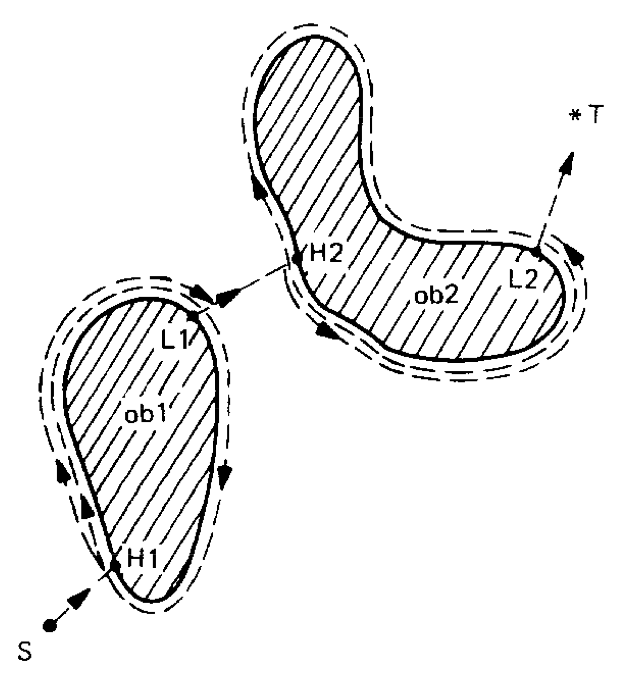
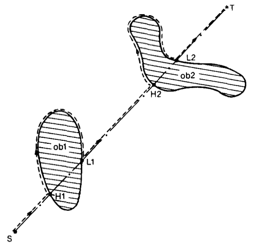
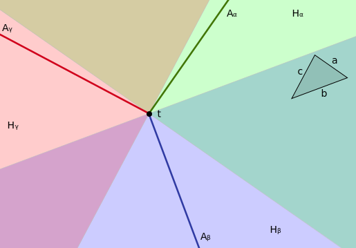

Title:    Autonomous Robot Motion
Author:   Thijs Vogels
Class:    ht
Date:     March 16, 2014
Keywords: computer science, proof, computational geometry
Language: en

# Dynamic Path Planning for a Memoryless Robot without Sight

Thijs Vogels

## Introduction 

Robot path planning is an active area within the field of mobile robotics. The problem of navigating a robot from a starting point $s$ to a target $t$ has proven to be extremely relevant to many applications in real life and it is definitely not trivial. 

Current research in the field is mostly focused on the development of intelligent learning robots that navigate through a scene as efficiently as possible by using a variety of sensory information and dynamically collecting data about the environment [sources]. In many cases the navigation algorithms found on board of modern robots are heuristic: although their average performance in terms of navigation time or path length tends to be high, there is no guarantee for the robot to reach its target within a bounded path-length.

These modern works are in contrast with the work of early pioneers in the field. Starting with contributions by Lumelsky [] and Papadimitriou and Yannakakis [], research in the late 1980’s started investigating navigational possibilities for all kinds of robots. Although some of the work indeed studies robots that either learn their environment [], have complete knowledge about any obstacles in the navigation space [] or receive information about the environment through visual sensors [], there are also studies that focus on more primitive robots. In [], several navigation algorithms for a robot with only three registers of memory that receives sensory feedback only when it actually hits an obstacle are evaluated. Both algorithms are concluded to guarantee reaching the target and the paper presents bounds on the ratio between the path taken and the optimal path under full knowledge of the scene.

This paper can be seen as a continuation of early research in robot motion planning. We study the simplest possible robot that could ever be able to find its way to a target: it is blind and memoryless. The robot’s objective is to travel from a starting point $s$ to a target $t$ in a two-dimensional scene $S$ consisting of a finite number of convex impenetrable obstacles. We assume the robot to be a point automaton, such that it can 'squeeze' through touching obstacles.
The robot only receives sensory feedback when it hits an obstacle. 
It can then follow the edge of the obstacle without knowing about the obstacle's shape.

We study our own algorithm, *BasicAlg*, by which the robot will always try to move in a straight line to $t$. When the robot hits an obstacle, it will follow the shape of the object in the direction that initially minimizes the distance to the target until the path to $t$ is clear again. It will repeat its behavior. We assume without loss of generality that if the robot hits an obstacle perpendicularly, the robot moves counterclockwise along the object's edge. This robotic behavior can be categorized as memoryless and dynamic, since it does not plan its path in advance, but decides on its direction every time it touches an obstacle, solely based on its current position, the position of the target and the gradient of the object it hits.

The paper starts with a literature review of earlier work on this topic and two similar algorithms by Lumelsky and John [] in particular. In the following sections, we will evaluate the behavior of our algorithm for cases when the obstacles in the scene are all axis-aligned squares, circles and, similar same-orientation triangles respectively. For squares we provide a tight upper bound on the ratio $\rho = R(S)/d(S)$ over all possible scenes, where $R(S)$ is the length of the path taken by the robot and $d(s)$ the distance between $s$ and $t$. We find numerical bounds for that ratio for a scene with circles, but these bounds are not tight. For triangles, the ratio is not bounded, but we prove that the robot will always reach the target if it follows our algorithm.

As a student, my role in this project was to (1) conduct a literature survey into previous work on robotic path planning and (2) to extend on the earlier work of Prof. Dr. Henk Meijer and Marijke Hengel by looking into the algorithm for scenes with circles and triangles. I found the proof for guaranteed reachability of $t$ when the obstacles are similar same-orientation triangles under Henk Meijer's supervision.

## Related Previous Theoretical Work

The first classification that can be applied to the broad field of motion planning is that of *offline* and *online* algorithms. *Offline* algorithms have complete information about the scene. The challenge is to find the optimal path for the robot through a number of known obstacles. These algorithms can be used for robots that are supplied with a map of their surroundings. The paths can be planned in advance, without the robot moving at all. The issues that are dealt with in this branch of motion planning are often related to computational complexity and with approximations for the shape of the scene and the robot. Because most of the algorithms make use of connectivity graphs, all shapes must be approximated by polygons in order for the planning algorithms to run in limited time and space. *Online* algorithms on the other hand are implemented in the robots behavior. The algorithms are therefore also termed 'dynamic'. The algorithms run continuously throughout the motion of the robot and use the robots current position and sensory information as input. Of course, offline algorithms can give more guarantees than online algorithms, but often, complete information is unavailable. In such situations, one must resort to a online algorithm. Another advantage of online algorithms is that they are mostly not computationally intensive: they often rely on simple choices to be made continuously. This paper's direction of choice is into dynamic (online) algorithms. Also, the algorithm that is proposed in this paper is classified as online.

A second subdivision that can be made is in the requirements for the robot's sensors. A substantial part of research is done into robots that have a vision sensor, and therefore have complete information on the part of the scene they look at. These algorithms tend to combine offline methods for local optimality with a dynamic approach for the global algorithm  . Early work on navigation with visual information was carried out by Sutherland  and Lumelsky & Skewis , and research into navigation with visual information is still an active topic. The alternative to the use of vision sensors are touch sensors. This type of robots only receives feedback the moment it touches an obstacles. Our algorithm falls in the second category, which is therefore more relevant to this paper.

Thirdly, we apply a classification introduced by Kareti e.a. . They divide robot navigation research into three classes:

* The goal of research that is classified as *Class A* is to guarantee a certain navigation objective. This objective could be drawing a map of the surroundings, navigating to a goal (point or wall) or anything else that requires navigation. It is not important that parameters such as the distance traveled are minimized, as long as the goal is reached.
* A *Class B* method needs to optimized some parameter(s). These could be for example the distance traveled, as in , or the ratio between the length of the path taken by the algorithm and the optimal path, like in  or this paper.
* *Class C* is concerned with computational issues. A *Class C*-paper could for example look into which problems can be solved by a robot with the computational power of a finite state machine. In a way, our work relates to this category in the sense that we study a memoryless robot. We explore the boundaries of what scenes can be successfully navigated through by these robots.

Finally, there is a division between heuristic and non-heuristic algorithms. Heuristic robot navigation algorithms can guarantee reaching a target in certain situations, possibly even within a certain bound whereas non-heuristic algorithms may fail to converge in some cases. Although guaranteed convergence is of course often desirable, it turns out that heuristic algorithms for motion planning often perform better than non-heuristic algorithms . Although they may perform badly or fail in some situations, they can still perform significantly better on average than heuristic variants.

### Two Algorithms

This section introduces two algorithms that have been presented by Lumelsky and Stepanov  for robots with similar capabilities as the robot simple machine. The algorithms are dynamic and can be followed by a robot without knowledge of the environment that only receive sensory feedback when hitting an obstacle, but in both cases, a few registers of memory are required. In that sense, the robots are less basic than the one we will study in this paper. For both of the algorithms, we will give information about the bounds that Lumelsky and Stepanov founds for their performance and in what cases they are non-heuristic. 

The first algorithm is called *Bug1*. It uses three registers, say $R_1$, $R_2$ and $R_3$ to store intermediate information. When free, the robot moves towards $t$. If the target is reached, the procedure stops. When an obstacle is encountered, define a hit point $H_j$. Now move along the edge of the obstacle that was hit in a fixed local direction. Assume without loss of generality that this is counter-clockwise. If the robot reaches the target, stop. Travel around the edge of the object until back at $H_j$. Along the way, keep track of three things: (1) store $L_j$, the point that is closest to the target, in $R_1$, (2) store the distance traveled along the edge in $R_2$, and the distance traveled since $L_j$ in $R_3$. Using the information in the latter two registers, we can now navigate along the edge in the most efficient way to leave it at $L_j$ and move towards $t$ again. The algorithm is illustrated in .

<figure id="fig:bug1">
    

        
    

    <figcaption>Illustration of the <em>Bug1</em>-algorithm.</figcaption>
</figure>

Two theorems identify the behavior of the *Bug1* algorithm quite well. Firstly, for any algorithm with the given information and robot capabilities and for any $\epsilon > 0$, there exists a scene for which the length $P$ of the path generated by the algorithm will obey the relationship $P \geq D + \Sigma\,p_i-\epsilon$, where $D$ is the distance between $s$ and $t$ and $\Sigma\, p_i$ is the sum of perimeters of the obstacles intersecting the line that connects $s$ and $t$. Secondly,  the length of a path generated by *Bug1* never exceeds the limit $P=D+1.5\cdot \Sigma\, p_i$. The algorithm is guaranteed to converge for scenes with arbitrary obstacles as long as the target and starting point are not enclosed in an obstacle.

<figure id="fig:bug2">
    

        
    

    <figcaption>Illustration of the <em>Bug2</em>-algorithm.</figcaption>
</figure>

## Notation and Conventions

## Equal Size Squares

This section goes through the earlier work by Henk and Marijke on equal size squares. It basically gives the proof as presented in <code>paper.henk.pdf</code>.

## Circles

This section will only be included if we do not manage to generalize our results to arbitrary convex objects. If we include it, it shows the numerical bounds for the worst-case heuristic paths over the optimal path or distance.

## Similar Same-Orientation Sharp Triangles

Asume all obstacles in $S$ to be similar triangles of the same orientation. We use a coordinate system with $t$ in the origin. The sides of triangle $k$ are called $a_k, b_k, c_k$ such that all sides $a_i$ have the same direction $\alpha$, all sides $b_i$ have direction $\beta$ and all sides $c_i$ have direction $\gamma$. For each side-direction $x\in \left\{\alpha,\beta,\gamma \right\}$, we define a half-plane $H_x$ that is delimited by a line in the direction $x$ through $t$. It indicates the region in which the robot could hit a triangle at a side in direction $x$. The half-planes are well defined because the robot always moves towards $t$.

Next, define ‘axes’. For a direction $x\in \left\{\alpha,\beta,\gamma \right\}$, define $A_x$ as a ray from the origin into $H_x$ that has a direction perpendicular to $x$. By definition, if a the robot hits an obstacle at the $x$-side, it will always be in $H_x$ and decide to move towards $A_x$.

<figure id="fig:illustration">
    
    <figcaption>Illustration of defined concepts. The half-planes $H_\alpha,H_\beta,H_\gamma$ and axes $A_\alpha,A_\beta,A_\gamma$ are shown for a scene with triangles of orientations $a,b,c$.</figcaption>
</figure>

<figure id="fig:m-distance">
    
    <figcaption>$M$-distance. The gray triangle indicates a set of points of equal $M$-distance.</figcaption>
</figure>

We aim to prove that if the robot crosses an axis $A_x$ at a Eudlidian distance $\lambda$ from $t$, it will never cross the same axis at a distance $\geq \lambda$ later in time.
In order to prove this, we start by introducing some concepts that play a role in the argument. 

### Definition 1.1

Define a custom measurement $M$ for a point's distance to $t$. Let $\Gamma_1$ be a triangle that is similar to the obstacles but rotated by $180^\circ$ compared to the obstacles. Let $\Gamma_1$ have its orthocenter in $t$ and a circumference of $1$. Note that the vertices of $\Gamma_1$ are by definition on the axes $A_\alpha,A_\beta$ and $A_\gamma$. The distance $M(p)$ of a point $p$ to $t$ is defined as the factor $f \geq 0$ with which $\Gamma_1$ should be scaled with respect to $t$ such that $p\in\Gamma_1$. 

### Definition 1.2

The heuristic path $HP(s,t)$ crosses the three axes 0 or more times. Let $\textbf{c} = \{c_1,c_2,\ldots\}$ be a vector containing those crossing points and let $A(c_i)$ be the corresponding axes and $H(c_i)$ the corresponding half-plane.

### Definition 1.3

For a point $p \in H_x$, define $D_x(p)$ as the $M$-distance between $t$ and the orthogonal projection of $p$ on $A_x$. $D_x(p)$ is not defined for points $p$ that are not in $H_x$. In the course of the proof, we will speak loosely about ‘the $D_x$’ of the robot in time. 

### Definition 1.4

### Lemma 1.1

For any direction $x\in\{\alpha,\beta,\gamma\}$, looking at the $D_x$ over time in the heuristic path of the robot, $D_x$ can only increase while the robot follows the side of an obstacle and it has started following that side at a point not in $H_x$.

#### Proof

Suppose the robot starts following the side of a triangle. At the moment it first touches the triangle, it is in the half-plane $H_x$. Suppose that $D_x$ increases while following the side. If the side is in the $x$-direction, $D_x$ will stay constant. If the side is not, $D_x$ decreases, since the robot always aims towards $t$. This contradicts the assumptions and proves lemma 1.1.

### Lemma 1.2

For any $x \not = y$, the intersection $A_x\cap H_y = \{t\}$.

#### Proof
This follows directly from the fact that the obstacles are sharp triangles. For a direction $x\in\{\alpha,\beta,\gamma\}$, the axis $A_x$ is perpendicular to the direction $x$, whereas the angles between $x$ and the other two directions are smaller than $90^\circ$.

### Lemma 1.3

An obstacle can only lie in 2 out of the 3 half-planes.

#### Proof

This follows from geometric observations. If the object would be in all three half-planes, it would enclose $t$, which is not allowed.

### Lemma 1.4

Let $\Gamma$ be a triangle with sides $a,b,c$ that intersects with the two axes $A_a$ and $A_b$. The intersections of side $c$ with these axes have the same $M$-distance.

#### Proof

This follows from the observation that along the side with direction $c$, the $M$-measure is constant by definition.

### Lemma 1.5

If $M(c_i)=\lambda$ for some $i$, then $M(c_{i+1})<\lambda$ or $M(c_{i+2})<\lambda$.

#### Proof

Consider the side of the obstacle $O_i$ that followed after $c_i$. We distinguish two scenarios: (1) at the moment the robot stops following the side, the robot is only in one half-plane. Without loss of generality, let this be $H_a=H(c_i)$. In the second scenario (2) the robot is both in $H_a$ and another half-plane when it stops following the side. Without loss of generality, let this second half-plane be $H_b$. 

1. If the robot ends up only in the half-plane $H_a$, it can only hit edges in the $a$-direction, and will move towards the axis $A_a$. Since, according to lemma 1.1, $D_a$ will decrease, the path will cross $A_a$ again, closer to $t$ than before. $M(c_{i+1})<\lambda$.
2. If the robot ends up in two half-planes $H_a$ and $H_b$, it will folow the same obstacle's $b$-side before leaving the edge of the $O_i$. After following this second side, it can either end up in (1) $H_a \cap H_b$ or (2) in $H_b$ only:
    1. If the robot is still in $H_a \cap H_b$, it did not cross $A_b$ (using lemma 1.2). Note that, if $D_b$ would be $\geq \lambda$, the obstacle $O_i$, $O_i$ would intersect with both $A_a$ and $A_b$. This is in contradiction with the observation that the robot did not cross $A_b$. We conclude that at this moment, $D_a < \lambda$ and $D_b < \lambda$. Since those measures monotomely decrease while the robot is in $H_a$ and $H_b$ and the robot now moves towards $A_a$ and $A_b$, it will intersect one of them at $M(c_{i+1})<\lambda$.
    2. If the robot is now only in $H_b$, it will inevitably move towards $A_b$. Following the same argument as directly above, if the robot did not cross the axis $A_b$, $D_b<\lambda$ and $M(c_{i+1})<\lambda$. Now we consider the case that the robot did cross $A_b$. Due to lemma 1.3, the robot is now only in half-plane $H_b$ and will move towards $A_b$. Although its current $D_b$ could be $\geq \lambda$, it will strictly move towards $A_b$. Since by lemma 1.4, the part of the axis with $D_b \geq \lambda$ is covered by $O_i$, the robot will now intersect the axis at a distance $M(c_{i+2})<\lambda$.

### Theorem 1.1

If the robot crosses an axis $A_x$ at a Eudlidian distance $\lambda$ from $t$, it will never cross the same axis at a distance $\geq \lambda$ later in time.

#### Proof

If for some $i$, $A(c_i)=A(c_{i+1})=A_x$, then $M(c_i) > M(c_{i+1})$. This follows from the fact that $D_x$ decreases while the robot is in $H_x$, and that the robot must cross another axis if it would leave $H_x$.

Furthermore, from lemma 1.5, we have that if the robot crosses two different axes after each other, it will eventually cross that axis at a smaller $M$-distance. Suppose the robot comes back to the axis $A_x$ at the $k$’th crossing $c_k$ after crossing a series of other axes. Let $O_k$ be the object along which the robot crosses at $c_k$ and let $p$ be the point at which the robot starts following $O_k$. Assume now that (contrary to the theorem) $M(c_k)\geq \lambda$. Repeatedly using lemma 1.4 we know that $M(p)<\lambda$, therefore, from lemma 1.4, the obstacle $O_k$ will cover the axis $A_x$ all the way between $c_k$ and the point on $A_x$ at $M$-distance $\lambda$. This is not possibe, since the object $O_i$ crosses the axis in this region too and objects are not allowed to intersect. 

We conclude that if the robot crosses an axis $A_x$ at a Eudlidian distance $\lambda$ from $t$, it will never cross the same axis at a distance $\geq \lambda$ later in time.

## Conclusion

Other shapes?

"These formulations, although abstract and simplified compared to real-life scenarios, provide the basis for practical systems by highlighting the underlying critical issues." 

## References

<ul class="references">
    
    <li id="papadimitriou">Papadimitriou, Christos H., and Mihalis Yannakakis. “Shortest paths without a map.” <em>Theoretical Computer Science</em> 84, no. 1 (1991): 127-150.</li>

    <li id="lumelsky">Lumelsky, Vladimir J., and Alexander A. Stepanov. “Dynamic path planning for a mobile automaton with limited information on the environment.” <em>Automatic Control, IEEE Transactions</em> on 31, no. 11 (1986): 1058-1063.</li>

    <li id="kareti">Kareti, Srikumar, Weimin Shi, and S. Sitharama Iyengar. <em>Robot navigation in unknown terrains: Introductory survey of non-heuristic algorithms</em>. Oak Ridge, TN: Oak Ridge National Laboratory, 1993.</li>

    <li id="blum">Blum, Avrim, Prabhakar Raghavan, and Baruch Schieber. “Navigating in unfamiliar geometric terrain.” In Proceedings of the <em>twenty-third annual ACM symposium on Theory of computing</em>, pp. 494-504. ACM, 1991.</li>

    <li id="lumelsky2">Lumelsky, Vladimir J., and Alexander A. Stepanov. “Path-planning strategies for a point mobile automaton moving amidst unknown obstacles of arbitrary shape.” <em>Algorithmica</em> 2, no. 1-4 (1987): 403-430.</li>

    <li id="lumelsky3">Lumelsky, Vladimir J. “Algorithmic and complexity issues of robot motion in an uncertain environment.” <em>Journal of Complexity</em> 3, no. 2 (1987): 146-182.</li>

    <li id="motlagh">Motlagh, Omid, Danial Nakhaeinia, Sai Hong Tang, Babak Karasfi, and Weria Khaksar. “Automatic navigation of mobile robots in unknown environments.” <em>Neural Computing and Applications</em>: 1-13.</li>

    <li id="ando">Ando, Hideki, Yoshinobu Oasa, Ichiro Suzuki, and Masafumi Yamashita. “Distributed memoryless point convergence algorithm for mobile robots with limited visibility.” <em>Robotics and Automation, IEEE Transactions</em> on 15, no. 5 (1999): 818-828.</li>

    <li id="baeza-yates">Baeza-Yates, R.A., Culberson, J.C. and Rawlins, G.J. Searching in the plane. <em>Information and Computation</em>, 1991.</li>

    <li id="lewis">Lewis, Jeremy S., and J. O'Kane. “Guaranteed navigation with an unreliable blind robot.” In <em>Robotics and Automation (ICRA)</em>, 2010 IEEE International Conference on, pp. 5519-5524. IEEE, 2010.</li>

    <li id="zhu">Zhu, David, and J-C. Latombe. “New heuristic algorithms for efficient hierarchical path planning.” <em>Robotics and Automation, IEEE Transactions</em> on 7, no. 1 (1991): 9-20.</li>

    <li id="hwang">Hwang, Yong K., and Narendra Ahuja. “A potential field approach to path planning.” <em>Robotics and Automation, IEEE Transactions</em> on 8, no. 1 (1992): 23-32.</li>

    <li id="oriolo">Oriolo, Giuseppe, Giovanni Ulivi, and Marilena Vendittelli. “Real-time map building and navigation for autonomous robots in unknown environments.” <em>Systems, Man, and Cybernetics, Part B: Cybernetics, IEEE Transactions</em> on 28, no. 3 (1998): 316-333.</li>

    <li id="chatterjee">Chatterjee, Ranajit, and Fumitoshi Matsuno. “Use of single side reflex for autonomous navigation of mobile robots in unknown environments.” <em>Robotics and Autonomous Systems</em> 35, no. 2 (2001): 77-96.</li>

    <li id="afyouni">Afyouni, Imad, Cyril Ray, and Christophe Claramunt. “Spatial models for context-aware indoor navigation systems: A survey.” <em>Journal of Spatial Information Science</em> 4 (2014): 85-123.</li>

    <li id="wong">Wong, Sylvia C., and Bruce A. MacDonald. “A topological coverage algorithm for mobile robots.” In <em>Intelligent Robots and Systems</em>, 2003. (IROS 2003). Proceedings. 2003 IEEE/RSJ International Conference on, vol. 2, pp. 1685-1690. IEEE, 2003.</li>

    <li id="lumelsky4">Lumelsky, Vladimir J. “Dynamic path planning for a planar articulated robot arm moving amidst unknown obstacles.” <em>Automatica</em> 23, no. 5 (1987): 551-570.</li>

    <li id="blake">Blake, A., M. Brady, R. Cipolla, Z. Xie, and A. Zisserman. “Visual navigation around curved obstacles.” In <em>Robotics and Automation</em>, 1991. Proceedings., 1991 IEEE International Conference on, pp. 2490-2495. IEEE, 1991.</li>

    <li id="sutherland">Sutherland, I. A method for solving arbitrary wall mazes by computer. <em>IEEE transactions on Computers</em>, C-18(12): 1092 1097 1969. </li>

    <li id="lumelsky-skewis">Lumelsky, V., Skewis, T. Incorporating range sensing in the robot navigation function. <em>IEEE Transactions on Systems, Man and Cybernetics</em>, 20(5): 1058, 1069, 1990.</li>

</ul>

## Acknowledgments

