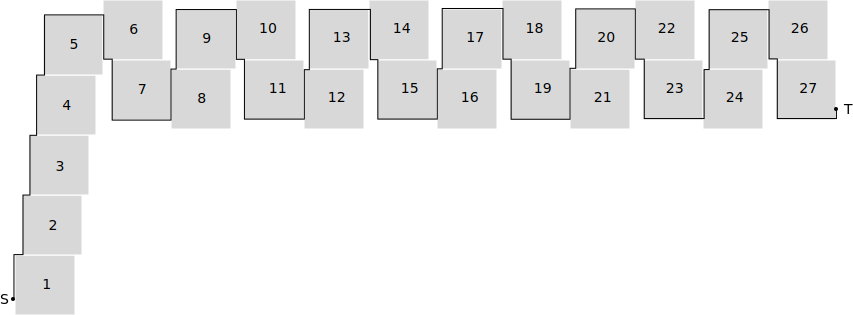

Title:    Autonomous Robot Motion
Author:   Thijs Vogels
Class:    ht
Date:     March 16, 2014
Keywords: computer science, proof, computational geometry
Language: en

# Dynamic Path Planning for a Memoryless Robot without Sight

Thijs Vogels

## Introduction 

Robot path planning is an active area within the field of mobile robotics. The problem of navigating a robot from a starting point $S$ to a target $T$ has proven to be extremely relevant to many applications in real life and it is definitely not trivial. 

Current research in the field is mostly focused on the development of intelligent learning robots that navigate through a scene as efficiently as possible by using a variety of sensory information and dynamically collecting data about the environment [sources]. In many cases the navigation algorithms found on board of modern robots are heuristic: although their average performance in terms of navigation time or path length tends to be high, there is no guarantee for the robot to reach its target within a bounded path-length.

These modern works are in contrast with the work of early pioneers in the field. Starting with contributions by Lumelsky [] and Papadimitriou and Yannakakis [], research in the late 1980’s started investigating navigational possibilities for robots with a diverse range of capabilities and requirements. Some of the work indeed studies robots that either learn their environment [], have complete knowledge about any obstacles in the navigation space [] or receive information about the environment through visual sensors []. On the other hand, there are also studies that focus on more primitive and fundamental robots. 

In [], two navigation algorithms for a robot with only three registers of memory that receives sensory feedback only when it actually hits an obstacle are evaluated. They belong to the category of fundamental problems. Both algorithms are concluded to guarantee reaching the target and the paper presents bounds on the ratio between the path taken and the optimal path under full knowledge of the scene.

This paper can be seen as a continuation of early research in robot motion planning. We study the simplest possible robot that could ever be able to find its way to a target: it is blind and memoryless and only remembers its coordinates and the coordinates of the target. The robot’s objective is to travel from a starting point $S$ to a target $T$ in a two-dimensional scene consisting of a finite number of convex impenetrable obstacles. We assume the robot to be a point automaton, such that it can 'squeeze' through touching obstacles.
The robot only receives sensory feedback when it hits an obstacle. 
It can then follow the edge of the obstacle without knowing about the obstacle's shape.

We study our own algorithm, *BasicAlg*, by which the robot will always try to move in a straight line to $T$. When the robot hits an obstacle, it will follow the outline of the object in the direction that initially minimizes the distance to the target until the path to $T$ is clear again. It then leaves the outline of the obstacle and repeats its behavior. We assume without loss of generality that if the robot hits an obstacle perpendicularly, the robot moves counterclockwise along the object's edge. This robotic behavior can be categorized as memoryless and dynamic, since it does not plan its path in advance, but decides on its direction every time it touches an obstacle, solely based on its current position, the position of the target and the gradient of the object it hits.

The paper starts with a literature review of earlier work on this topic and two similar algorithms by Lumelsky and John [] in particular. In the following sections, we will evaluate the behavior of our algorithm for cases when the obstacles in the scene are all axis-aligned squares, circles, and similar same-orientation triangles respectively. For squares we provide a tight upper bound on the ratio $\rho = |R(S,T)|/|O(S,T)|$ over all possible scenes, where $|R(S,T)|$ is the length of the path taken by the robot and $|O(S,T)|$ the length of the optimal path from $S$ to $T$. We find numerical bounds for that ratio for a scene with circles, but these bounds are not tight. For triangles, the ratio is not bounded, but we prove that the robot will always reach the target if it follows our algorithm.

As a student, my role in this project was to (1) conduct a literature survey into previous work on robotic path planning and (2) to extend on the earlier work of Prof. Dr. Henk Meijer and Marijke Hengel by looking into the algorithm for scenes with circles and triangles. I found the proof for guaranteed reachability of the target when the obstacles are similar same-orientation triangles under Henk Meijer's supervision.

## Related Theoretical Work

The first classification that can be applied to the broad field of motion planning is that of *off-line* and *on-line* algorithms. *Off-line* algorithms are provided complete information about the scene. The challenge for an off-line algorithm is to find the optimal path for the robot through a scene with a number of known obstacles. These algorithms can be used for robots that are supplied with a map of their surroundings. The paths can be planned in advance, without the robot moving at all. The issues that are dealt with in this branch of motion planning are often related to computational complexity [] and with approximations for the shape of the scene and the robot []. Because most of the algorithms make use of connectivity graphs, all shapes must be approximated by polygons in order for the planning algorithms to run in limited time and space. *On-line* algorithms on the other hand are implemented in behavior of a robot. The algorithms are therefore also termed 'dynamic'. The algorithms run continuously throughout the path of the robot and use the robot's current position and sensory information as input. Of course, off-line algorithms can give more guarantees than on-line algorithms, but most often, complete information is unavailable. In such situations, one must resort to a on-line algorithm. Another advantage of on-line algorithms is that they are mostly not computationally intensive: they often rely on simple choices that are to be made continuously. This paper's direction of choice is into dynamic (i.e. on-line) algorithms. The algorithm that is proposed in this paper is also classified as on-line.

A second subdivision that can be made is in the requirements for the robot's sensors. A substantial part of research is done into robots that have a vision sensor, and therefore have complete information on the part of the scene they look at. These algorithms tend to combine off-line methods for local optimality with a dynamic approach for the global algorithm  . Early work on navigation with visual information was carried out by Sutherland  and Lumelsky & Skewis , and research into navigation with visual information is still an active topic []. The alternative to the use of vision sensors are touch sensors. This type of robot only receives feedback the moment it touches an obstacles. Our algorithm falls in the second category, which is therefore more relevant to this paper.

Thirdly, we apply a classification introduced by Kareti e.a. . They divide robot navigation research into three classes:

* The goal of research that is classified as *Class A* is to guarantee a certain navigation objective. This objective could be drawing a map of the surroundings, navigating to a goal (point or wall) or anything else that requires navigation. It is not important that parameters such as the distance traveled are minimized, as long as the goal is reached.
* A *Class B* method needs to optimized some parameters. These could be for example the distance traveled, as in , or the ratio between the length of the path taken by the algorithm and the optimal path, like in  or this paper.
* *Class C* is concerned with computational issues. A *Class C*-paper could for example look into which problems can be solved by a robot with the computational power of a finite state machine. In a way, our work relates to this category in the sense that we study a memoryless robot. We explore the boundaries of what scenes can be successfully navigated through by these robots.

Finally, there is a division between heuristic and non-heuristic algorithms. Heuristic robot navigation algorithms can guarantee reaching a target in certain situations, possibly even within a certain bound whereas non-heuristic algorithms may fail to converge in some cases. Although guaranteed convergence is of course often desirable, it turns out that heuristic algorithms for motion planning often perform better than non-heuristic algorithms . Although they may perform badly or fail in some situations, they can still perform significantly better on average than heuristic variants.

### Two Algorithms

<figure id="fig:bug1">
    

        
    

    <figcaption>Illustration of the <em>Bug1</em>-algorithm. By going around the outline of an obstacle between 1 and 1.5 times in order to leave the obstacle at a point closest to the target, this algorithm reaches guaranteed convergence for any scene in which $S$ and $T$ are not enclosed by an obstacle. The algorithm uses three registers of memory.</figcaption>
</figure>

<figure id="fig:bug2">
    

        
    

    <figcaption>Illustration of the <em>Bug2</em>-algorithm. This algorithm solves the issue of guaranteed convergence to the target by keeping the $ST$-line in memory. After following an obstacle, <em>Bug2</em> will approach $T$ on that line. This method does not perform well when the scene contains concave obstacles that cross $ST$ often.</figcaption>
</figure>

This section introduces two algorithms that have been presented by Lumelsky and Stepanov   for robots with similar capabilities as our basic robot that can follow *BasicAlg*. The algorithms are dynamic and can be followed by a robot without knowledge of the environment that only receive sensory feedback when hitting an obstacle. In both cases, however, a few registers of memory are required. In that sense, the robots are less basic than the one we will study in this paper. For both of the algorithms, we will give information about the bounds that Lumelsky and Stepanov founds for their performance and in what cases they are non-heuristic. 

The first algorithm is called *Bug1*. It uses three registers, say $R_1$, $R_2$ and $R_3$ to store intermediate information. When free, the robot moves towards $T$. If the target is reached, the procedure stops. When an obstacle is encountered, define a hit point $H_j$. Now move along the edge of the obstacle that was hit in a fixed local direction. Assume without loss of generality that this is always counter-clockwise. If the robot reaches the target, stop. Travel around the edge of the object until back at $H_j$. Along the way, keep track of three things: (1) store $L_j$, the point that is closest to the target, in register $R_1$, (2) store the distance traveled along the edge in $R_2$, and the distance traveled since $L_j$ in $R_3$. Using the information in the latter two registers, we can now navigate along the edge in the most efficient way to leave the obstacle at $L_j$ and move towards $T$ again. The algorithm is illustrated in .

Two theorems are used to access the performance of the *Bug1*-algorithm. Firstly, Lumelsky  finds that for any algorithm with the given information and robot capabilities and for any $\epsilon > 0$, there exists a scene for which the length $|R(S,T)|$ of the path generated by the algorithm will obey the relationship $|R(S,T)| \geq d(S,T) + \Sigma\,p_i-\epsilon$, where $d(S,T)$ is the distance between $S$ and $T$ and $\Sigma\, p_i$ is the sum of perimeters of the obstacles intersecting the line that connects $S$ and $T$. Secondly,  the length of a path generated by *Bug1* never exceeds the limit $|R(S,T)|=d(S,T)+1.5\cdot \Sigma\, p_i$. The algorithm is guaranteed to converge for scenes with arbitrary obstacles as long as the target and starting point are not enclosed in an obstacle.

Now, let's look at *Bug2*, the second algorithm proposed by Lumeksly and Stepanov. The algorithm goes as follows: Follow the line between $S$ and $T$. When the target is reached, stop. When an obstacle is encountered, define a hit point $H_j$ and move around the object in a fixed local direction. Assume the local direction without loss of generality to be counter-clockwise. Move along the edge of the obstacle until either the target is reached or the robot crosses the line between $S$ and $T$. In the latter case, move on towards $T$. The algorithm is illustrated in  

This algorithm too needs some memory to keep track of where the line that connects $S$ and $T$ is exactly. Although this algorithm intuitively produces shorter paths than *Bug1*, it can generate cycles when concave obstacles intersect the $ST$-line multiple times. A worst-case bound on the performance of the algorithm is given by $|R(S,T)|=d(S,T)+\sum \frac{n_i p_i}{2}$, where $n_i$ is the number of intersections between $ST$ and the $i$-th obstacle on $ST$, and $p_i$, its perimeter. For convex obstacles, the upper bound for the length of the path simplifies to the worst-case $|R(S,T)|=d(S,T)+\Sigma\,p_i$ and on average $|R(S,T)|=d(S,T)+0.5\cdot \Sigma\,p_i$. Together with the universal earlier lower bound presented in the paragraph on the *Bug1*-algorithm, it follows that this bound is tight.

The two algorithms presented are guaranteed to converge for any scene and can be said to perform reasonably well, with a bound based on the perimeters on the obstacles in the scene. The algorithm proposed in this paper, *BasicAlg*, will not have such strong properties, but has the advantage of assuming no robot memory at all. In a way, it goes back to the essence of the navigation problem even more. Furthermore, in some situations, the basic algorithm could even perform better than *Bug1* and *Bug2* [...].

## Notation and Conventions

Outline for this section:

* $S$ and $T$ as start and target
* Half planes $\Pi_\alpha$.
* Hit points $H_i$
* Leave points $L_i$
* Obstacle $\Omega_i$
* Edge = whole edge
* Side = side of a polygonal obstacle
* Formal formulation of the algorithm here.
* If in doubt, take a left.
* $R(S,T)$ robot path: $R(A,B)$ path between $A$ and $B$.
* $d(S,T)$ distance
* $O(S,T)$ optimal path
* Lengths go like $|R(S,T)|$.
* $\rho = \max |R(S,T)|/|O(S,T)|$ over all possible pairs of $S$ and $T$ under all configurations under consideration
* $\lambda = \max |R(S,T)|/d(S,T)$ over all possible pairs of $S$ and $T$ under all configurations under consideration
* Note that always $\lambda >= \rho$.
* local direction
* $L_1$ metric: $|R(S,T)|_{L_1}$.
* $x$ and $y$ coordinates: $A_x$, $A_y$
* $AB$ is the line through $A$ and $B$

## Equal Size Squares

This section goes through the earlier work by Prof. Dr. Henk Meijer and Marijke Hengel, that was conducted in the setting of an honors thesis. They investigated the configurations for the space $S$ where all obstacles are *equal size axis-aligned squares*. This section includes their findings. It is the first of three sections that each try to find bounds on the length of the robot path $|R(S,T)|$ for *BasicAlg* in a specific type of scenes.

We will derive a tight bound of $\rho = \sqrt{10}$ on the length of the robot path over the optimal path, but first, we will show that if there is only one obstacle, then $\rho < 3$ and for any, however small $\epsilon > 0$ there are are configurations such that $\rho > 3-\epsilon$. Secondly, we show that if $S$ and $T$ are restricted to lie on the same horizontal or vertical line and there are arbitrarily many obstacles, we also have $\rho < 3$ and that for any $\epsilon > 0$ there are configurations such that $\rho  > 3-\epsilon$. Finally, all pieces can be brought together in finding that for any scene with obstacles that are axis-aligned unit squares, there is a tight bound of $3 - \epsilon < \rho < 3$. The structure of the proof is divided into several lemmas.

    If the scene contains exactly one square obstacle, we have $|R(S,T)| < 3d(S,T)$.

    Let $S$ and $T$ be two points. If $ST$ does not intersect the interior of the obstacle, we have $|R(S,T)| = d(S,T)$. Now define a coordinate system along the sides of the obstacle. If $ST$ intersects two consecutive sides of the obstacle, we have $|R(S,T)| < |R(S,T)|_{L_1} \leq \sqrt{2} \cdot d(S,T)$ since $\sqrt{2} $ is the maximum ratio between the hypotenuse and the sum of the lengths of a right-angle triangle. So in both cases the lemma holds.

    Now assume that $ST$ intersects two opposite edges of the obstacle and that the ratio $|R(S,T)|_{L_1} / d(S,T) $ is maximal. Without loss of generality assume that the obstacle is axis-aligned with corners at (0,0) and (1,1), that $ST$ intersects the vertical edges of the obstacle and that $S_x < T_x$. If $S_y < T_y$ we can increase $S_y$ by some small value $\delta$ and decrease $T_y$ by $\delta$ so that $|R(S,T)|_{L_1}$ remains unchanged and $d(S,T)$ decreases. In this case, the ratio $|R(S,T)|_{L_1} / d(S,T)$ was clearly not maximal. Similarly, the ratio cannot be maximal when $S_y > T_y$, so $S_y = T_y$. If $S_x < 0$ we can increase $S_x$ by some small value $\delta$ so that $|R(S,T)|_{L_1}$ and $d(S,T)$ decrease by $\delta$ so the ratio $|R(S,T)|_{L_1} / d(S,T) $ increases. Therefore $S_x = 0$ and similarly we show that $T_x = 1$. It is now not hard to see that $|R(S,T)|_{L_1} / d(S,T) < 3.$

    We say that a path is $x$-monotone if the $x$-coordinates of a point that travels along the path do either not decrease or not increase along the way. We define $y$-monotone similarly.

    Consider a scene with obstacles that are axis-aligned rectangles. Let $P$ be a point on the path $R(S,T)$ with $P_x < T_x$ and $P_y < T_y$. Assume that $R(S,T)$ immediately after $P$ travels in direction $(a,b)$ with $a \geq 0$ and $b \geq 0$. If $R$ is the first point on $R(S,T)$ after $P$ with $R_x = T_x$ or $R_y = T_y$ then the path $R(S,T)$ from $P$ to $R$ is $x$- and $y$-monotone.

    After the point $P$, the path $R(S,T)$ will first travel along the line segment $PT$. If $R(S,T)$ hits a left vertical boundary of an obstacle, it will continue to travel in direction $(0,1)$. If $R(S,T)$ hits a bottom horizontal boundary of an obstacle, it will continue to travel in direction $(1,0)$. In either case, it will continue to travel in direction $(0,1)$ or $(1,0)$ until it either hits the $x$- or the $y$-axis, or reaches another point $Q$ from which it travels along the line segment $QT$. In that case we can repeat the argument. We conclude that both the $x$- and $y$-coordinates do not decrease.

    Consider obstacles that are equal size unit squares. Suppose $S$ and $T$ lie on the $x$-axis. In this case any point on $R(S,T)$ is bounded to the box with $-1 < P_y < 1$.

    Without loss of generality, assume that $S$ and $T$ lie on the $x-$axis with $S_x < T_x$. Consider $P_y$ to be a function whose parameter is a point $P$ that travels along $R(S,T)$ from $S$ to $T$ and whose value is the $y$-coordinate of $P$. Observe that the absolute value of $P_y$ can only increase if $P$ lies on the left vertical side of an obstacle (and not on a corner of the obstacle). The point $P$ travels upward if the first point of $R(S,T)$ on this side has a $y$-coordinate  $\leq 0$, and downwards if it positive. In both cases it follows that $-1 < P_y < 1$ for all points $P$. 

The above lemma implies that if $S_x = T_x$ and $S_y < T_y$ there is no point $P$ on $R(S,T)$ with $P_y > T_y$: let $Q$ be the first point of $R(S,T)$ with $Q_y = T_y$. Since $-1 < Q_x < 1$ there can be no obstacle between $Q$ and $T$, so after $Q$, the path $R(S,T)$ stays on the line $y = T_y$.

    If $S$ and $T$ lie on the same horizontal or vertical line, and the obstacles are axis aligned unit squares, we have $R(S,T) < 3d(S,T)$.

    Let $n$ be the number of obstacles. We prove the lemma by induction on $n$. If $n=1$ the lemma holds by . Assume that the lemma holds if there are $n$ obstacles for some $n \geq 1$. Now assume that there are $n+1$ obstacles. Assume without loss of generality that $S$ and $T$ are both on the $x$-axis with $S_x < T_x$. The path $R(S,T)$ then first travels to the right on the $x$-axis until it hits the first obstacle at a point $H_1$. The path then runs upwards along the side of the obstacle. So the path continues until it hits the right top corner $L_1$ of the obstacle. From $L_1$ the path travels in a direction $(a,b)$ with $a > 0$ and $b \leq 0$.

    By  we derive that the path after $H_1$ and $L_1$ has monotone $x$- and $y$- coordinates until it reaches the $x$-axis at $W$ or the $y$-axis at point $Z$. In the latter case we derive from  that $-1 < Z_y > 1$ so $R(S,T)$ from $Z$ to $T$ follows the $y$-axis and the statement of the lemma holds. If the path reaches $W$, we know that from the inductive assumption that 

[[ |R(W,T)| < 3d(W,T). ]]

Moreover we have

[[ |R(S,W) \leq |SH_1| + |H_1L_1| + d_{L_1} (L_1,W)  \leq 3d(S,W), ]]

so

[[ |R(S,T)| = |R(S,W)| + |R(W,T)| < 3 d(S,W) +  3 d(W,T) = 3d(S,T). ]]

So the lemma holds.

<figure id="fig:equalsquares" style="float:bottom">
    
    <figcaption>Illustration of the constructive proof in this chapter. By placing unit squares in the way illustrated in this figure, a lower bound on the ratio $\rho$ can be set to $\sqrt{10}$.</figcaption>
</figure>

If $S$ and $T$ lie on the same horizontal or vertical line, and the obstacles are equal size axis aligned squares, then there is a configuration for which 

[[ \frac{|R(S,T)|}{O(S,T)} > 3 - \epsilon ]]

for any, however small $\epsilon > 0$.

This is a proof by construction. Let the number of obstacles $n$ be odd and define some constant $\delta$ with $0 < \delta < 1$. Let $S = (0,0)$ and $T = ((n+1)/2+(n-3)\delta,0)$. Place obstacle 1 with its left-bottom corner at $(0,-\delta)$. Place square $2$ to the right of square $1$, and shift it up by $2\delta$. Place square $3$ below square $2$, and shift it right by $\delta$. Place square $4$ to the right of square $3$, and shift it down by $2\delta$. Place square $5$ above square $4$, and shift it right by $\delta$. We keep adding squares in groups of two, by repeating the last 4 placements. Notice that the heuristic path zigzags through the odd numbered squares. The placement of the obstacles is illustrated in , looking at the squares numbered 4 or higher. We have

[[ |R(S,T)| > \frac{3(n+1)}{2} ]]

and

[[ d(S,T) < \frac{n+1}{2} (1+\delta) ]]

Furthermore, we know that

[[ \lim_{\delta \rightarrow 0} \frac{3(n+1)} {(n+1) (1+\delta)} = 3, ]]

so using  we know that $|R(S,T)|/|O(S,T)| < 3$. We conclude that the lemma holds.

    If $S$ and $T$ lie on the same horizontal or vertical line, and the obstacles are equal size axis aligned squares, we have $3 - \epsilon < \rho < 3$  for any $\epsilon > 0$.

    This follows from  and .

If the obstacles are equal size axis aligned squares, we have 

[[ \lambda = \max \frac{|R(S,T)|}{d(S,T)} < \sqrt{10}. ]]

    Without loss of generality, assume that $S_x < 0$, $S_y < 0$ and $T = (0,0)$. From  we derive that $(R(S,T)$ is initially $x$- and $y$-monotone until it intersects that $x$- or $y$-axis for the first time, at point $P$ say. Without loss of generality assume that $P$ lies on the $x$-axis. Let $Q = (S_x,0)$. We have

[[ |R(S,T)| &\leq d_{L_1}(S,P) + |R(P,T)| \\ &< d(S,Q) + d(Q,p) + 3d(P,T)
\leq d(S,Q) + 3d(Q,T). ]]

    Consider the function $f(a,b) = (a+3b)/\sqrt{a^2 + b^2}$. By computing the gradient of $f$ and setting it to (0,0), we find that the maximum value of $f$ occurs at $a=1$ and $b=3$ and is $\sqrt{10}$. It turns out that $f(a,b) \leq \sqrt{10}$ for all $a$ and $b$. Let $a = d(S,Q)$ and $b = d(Q,T)$.

[[ \frac{|R(S,T)|}{d(S,T)} < \frac{a+3b}{\sqrt{a^2 + b^2}} \leq \sqrt{10}. ]]

This proves the lemma.

If the obstacles are equal size axis aligned squares, then there is a configuration for which 

[[ \rho = \max \frac{|R(S,T)|}{|O(S,T)|} > \sqrt{10} - \epsilon ]]

for any $\epsilon > 0$.

    Let $k$ be a large even integer and let $\delta \leq 1/k$. For an illustration of the construction in this proof, see , where $k=4$. In the figure we used  $\delta = 1/8$. Place $S$ at (0,0) and $T$ at $( 3k(1+\delta)+(k-1)\delta,k)$. Place $7k-1$ rectangles as follows. Place square 1 with its left-bottom corner at $(0,-\delta)$. For $1 < i \leq k+1$, place square $i$ on top of square $i-1$, shifted $\delta$ to the right. Place square $k+2$ to the right of square $k+1$, and shift it up by $2\delta$. Place square $k+3$ below square $k+2$, and shift it right by $\delta$. Place square $k+4$ to the right of square $k+3$, and shift it down by $2\delta$. Place square $k+5$ above square $k+4$, and shift it right by $\delta$. As shown in the figure, we keep adding squares in groups of two, by repeating the last 4 placements. Notice that the heuristic path zigzags through the odd numbered squares that have numbers $> k$.

    We have $|R(S,T)| \approx k + 3\cdot 3k = 10k$ and $|O(S,T)| \approx \sqrt{k^2 + (3k)^2} $ so

[[ |R(S,T)|  \approx \sqrt{10} \cdot |O(S,T)|. ]]

    We can show that we can show $k$ such that the fraction is arbitrarily close to $\sqrt{10}$. We have

[[ |R(S,T)| > k  + 3k (3 - 2\delta) = 10k - 6k\delta \geq 10k - 6. ]]

[[ |O(S,T)| < 2 + \sqrt{(3k (1+\delta))^2 + k^2} = 2 + k\sqrt{10   + 18 \delta  + 9 \delta^2}. ]]

Since $\delta \leq 1/k$ we have 

[[ \lim_{k \rightarrow \infty} \frac{10k - 6} {2 + k\sqrt{ 10   + 18 \delta  + 9 \delta^2}} = \sqrt{10}. ]]

So the lemma holds.

    If the obstacles are equal size axis aligned squares, we have $\sqrt{10}-\epsilon < \rho < \sqrt{10}$  for any $\epsilon > 0$.

    This follows from  and  using the fact that $\rho < \lambda$.

### Comparing Performance 

Comparing the results in this section with the performance of Lumelsky and Stepanov's *Bug1* and *Bug2* algorithms , we find in the limiting case of $d(S,T)=|O(S,T)|\to \infty$ and filling in $p_i=4$ that for *Bug1* $|R(S,T)| \leq d(S,T) + 6 d(S,T)$, so $\rho \leq 7$. The performance of this algorithm is in this specific situation significantly lower than that of *BasicAlg*, even though the robot for *Bug1* has slightly higher requirements.

Similarly, we can look at the performance of *Bug2* in this particular set of scenes. We find that for *Bug2*, $\rho \leq 5$. Using Lumelsky and Stepenov's result that $|R(S,T)| \geq d(S,T) + \Sigma\,p_i-\epsilon$, we can see that at least for *Bug2*, this bound on $\rho$ is tight.

<!-- ## Axis Aligned Squares of Any Size

I forgot that we have these results as well. I have to add this section and fix references in the rest of the paper. Somewhere I speak about *3 sections*, that should be 4. Furthermore, I introduce the results in the intro, etc.
 -->

## Circles

This section investigates scenes in which all obstacles are circles. Although we could not find exact bounds on the performance of *BasicAlg* in this situation, we have numerical upper- and lower bounds on $\rho$ that were derived by Dr. Meijer earlier. These bounds are not yet tight. Again, we prove the bounds in the structure of a series of lemmas. The structure will be similar to that of the previous section. The first lemma will show that if there is only one obstacle, then $1.086 < \rho < \pi/2$. We also show that is there are an arbitrary number of obstacles then $1.086 < \rho < 1.666$ there is something better right, and in your manuscript, it says 2 instead of 1.6666?. Lastly we show how with the help of *Mathematica* we can tighten the above bounds. 

If the scene contains one circular obstacle, then 
    
[[ \lambda = \max \frac{|R(S,T)|}{d(S,T)} \leq \tfrac{1}{2}\pi ]]

    Let $S$ and $T$ be two points. Assume that  $ST$ intersects the disk and that the ratio $|R(S,T)| / d(S,T)$ is maximal. If $S$ does not lie on the disk, we can move it a bit closer to $T$, so both $d(S,T)$ and  $|R(S,T)|$ decreases by some infinitesimal value $\delta$. Since $|R(S,T)| / d(S,T) > 1$, this operation increases $|R(S,T)| / d(S,T)$. This shows that the ratio $|R(S,T)| / d(S,T)$ was not maximal.

    If $T$ does not lie on the disk, we can move it a bit closer to $S$, so $d(S,T)$ decreases by some small value $\delta$ and $|R(S,T)|$ decreases with less than $\delta$. This operation also increases $|R(S,T)| / d(S,T)$. This shows that the ratio $|R(S,T)| / d(S,T)$ was not maximal. We conclude that both $S$ and $T$ lie on the disk. Now it is easy to see that $ST$ is a diagonal of the disk and $|R(S,T)| = \tfrac{1}{2}\pi \cdot d(S,T)$. 

If there is one circular obstacle 

[[\rho = \max \frac{|R(ST)|}{|O(S,T)|} > 1.086]]
    

    Let $S = (2.562,0)$ with $x > 1$, $T = (-1,0)$ and let the obstacle be a unit disk centered at the origin. We have $|R(S,T)| = 1.562+\pi$. Moreover,

[[|O(S,T)| = \sqrt{2.562^2 - 1} + \pi - \arccos (1/2.562).]]

    This gives 

[[ \frac{|R(S,T)|}{|O(S,T)|} ~\approx~ 1.08614 > 1.086, ]]

which proves the lemma.

In a configuration with one circular obstacle and a maximal value of $|R(S,T)|/|O(S,T)|$  it is not hard to see that $T$ lies on the obstacle. We used both Mathematica as well as program written in Java to solve this problem, and both implementations computed that in the optimal configuration, we have $x \approx 2.562$, $y = 0$ and $\rho = |R(S,T)|/|O(S,T)| \approx 1.08614$, so this confirms that the bound in the previous lemma is almost tight.
 
We first prove a lemma we need when computing an upper bound on $\rho$. If $A$ and $B$ lie on a disk then we use the notation $arc(A,B)$ to denote the length of the shortest arc on the disk from $A$ to $B$. Henk, should this stay here or go to the notations section?

If $S$ lies on a disk, $ST$ intersects the disk and $P$ is the last point
of $R(S,T)$ on the disk, then

[[\frac{arc(S,P)}{d(S,T)- d(P,T)} \leq 1.666]]

    Suppose that we have a configuration in which $ratio = arc(S,P)/(d(S,T)- d(S,T))$ is maximal. If $ST$ does not contain the diameter, we move move $T$ away from $P$ along the line through $P$ and $T$. This increases$ d(S,T)$ by less than $d(S,T)$ increases, while $arc(S,P)$ remains equal, so the ratio increases. Therefore $ST$ does contain the diameter of the disk. By placing $S$ at $(-1,0)$, the disk centered at the origin and $T$ at $(x,0)$, we can compute that

[[ ratio  = \frac{arc(S,P)}{d(S,T)- d(P,T)} = \frac{\pi}{x+1 - \sqrt{x^2-1}}.]]

    This function is maximal at $x \approx$ 1.341 where $ratio \approx 16656$.

If there are an arbitrary number of circular obstacles, then 

[[ \lambda = \frac{|R(ST)|}{d(S,T)} \leq 1.666.]]

    We prove this lemma by induction on $n$, the number of obstacles. The lemma holds for $n=1$ by . Assume the lemma holds for $n\geq 1$ obstacles. We now assume to have $n+1$ obstacles and we have a configuration with the maximal value of $|R(ST)|/d(S,T)$. As before we can argue that $S$ lies on an obstacle. Assume that $S$ lies on the unit disk centered at the origin. Let $P$ be the last point of $R(S,T)$ on this disk. Then by induction we have $|R(P,T)| \leq 1.666 d(P,T)$. From  we have that the length of  $arc(SP) < 1.666 (d(S,T) - d(P,T))$. So

 

[[|R(S,T)| &= arc(SP) + |R(P,T)| \\ &\leq 1.666 (d(S,T) - d(P,T)) + 1.666 d(P,T) =  1.666d(S,T),]]

which proves the lemma.

There is a configuration for a scene with a number of disks as obstacles for which

[[\frac{|R(ST)|}{|O(S,T)|} > 1.086]]

This is a proof by construction. The construction was carried out in a Java program. Figure # illustrates the construction and the code is available in the Appendix. Henk, how is this configuration? This is the spiral-thing, I assume. Do you have a definition of it?

We conclude that $1.085 < \rho < 1.6666$. This bound is not tight. We expect that there should be configurations possible that show a higher ratio than $1.085$, but also $1.6666$ seems a very generous upper bound.

### Comparing Performance

For configurations with circles, our *BasicAlg* again generates a significantly lower upper bound on $\rho$ than *Bug1*. This is illustrated by the scene in which $S$ and $T$ lie on opposite sides a disk, at an infinitesimal distance $\delta>0$ from its boundary such that $ST$ goes through the middle of the disk. The ratio $|R(S,T)|/O(S,T)$ for this situation gets as high as 3. For this particular configuration, *Bug2* performs the same as our algorithm.

An investigation of several other configurations with circles shows that mostly, the performance of *Bug1* relatively weak, while *Bug2* performs very well and the performance of *BasicAlg* performs well in most situations.

If I have enough time, I'm gonna compare a little more here. Do you think the above paragraph would be too weak to put in if there is <b>not</b> enough time?

## Similar Same-Orientation Sharp Triangles

In the line of the previous sections, this section investigates scenes in which all obstacles are similar same-orientation sharp triangles. Although the ratio $\rho$ under *BasicAlg* is unbounded in this case, we prove that convergence of *BasicAlg* is guaranteed.

Assume all obstacles in $S$ to be similar triangles of the same orientation. We use a coordinate system with $T$ in the origin. The sides of triangle number $k$ are called $a_k, b_k, c_k$ such that all sides $a_i$ have the same direction $\alpha$, all sides $b_i$ have direction $\beta$ and all sides $c_i$ have direction $\gamma$. Now consider the direction $\alpha$. We define a half-plane $\Pi_\alpha$ that is delimited by a line in the direction $\alpha$ through $T$. It indicates the region in which the robot could hit a triangle at a side in direction $\alpha$. Define the half-planes $\Pi_\beta$ and $\Pi_\gamma$ accordingly. The half-planes are well defined because the robot always moves towards $T$.

Next, define ‘axes’. For the direction $\alpha$, define $A_\alpha$ as a ray from the origin into $\Pi_\alpha$ that is perpendicular to $\alpha$. By definition, if a the robot hits an obstacle at the $\alpha$-side, it will always be in $\Pi_\alpha$ and decide to move towards $A_\alpha$. Define $A_\beta$ and $A_\gamma$ similarly. Those axes have the same properties.

<figure id="fig:illustration">
    
    <figcaption>Illustration of defined concepts. The half-planes $\Pi_\alpha,\Pi_\beta,\Pi_\gamma$ and axes $A_\alpha,A_\beta,A_\gamma$ are shown for a scene with triangles of orientations $a,b,c$.</figcaption>
</figure>

<figure id="fig:m-distance">
    
    <figcaption>$M$-distance. The gray triangle indicates a set of points of equal $M$-distance.</figcaption>
</figure>

We aim to prove that if the robot crosses an axis $A_x$ at a Euclidean distance $d$ from $T$, it will never cross the same axis at a distance $\geq d$ later in time. In order to prove this, we start by introducing some concepts that play a role in the argument. 

    Define a custom measurement $M$ for a point's distance to $T$. Let $\Gamma_1$ be a triangle that is similar to the obstacles but rotated by $180^\circ$ compared to the obstacles. Let $\Gamma_1$ have its orthocenter in $T$ and a circumference of $1$. Note that the vertices of $\Gamma_1$ are by the definition of the orthocenter on the axes $A_\alpha,A_\beta$ and $A_\gamma$. The distance $M(P)$ of a point $P$ to $T$ is defined as the factor $f \geq 0$ with which $\Gamma_1$ should be scaled with respect to $T$ such that $p\in\Gamma_1$. 

    The heuristic path $R(S,T)$ crosses the three axes 0 or more times. Let $\textbf{C} = \{C_1,C_2,\ldots\}$ be a vector containing those crossing points and let $A(C_i)$ be the corresponding axes and $\Pi(C_i)$ the corresponding half-plane.

    Consider one of the three half-planes. Without loss of generality, assume this to be $\Pi_\alpha$. For a point $P \in \Pi_\alpha$, define $D_\alpha(P)$ as the $M$-distance between $T$ and the orthogonal projection of $P$ on $A_\alpha$. $D_\alpha(P)$ is not defined for points $P$ that are not in $\Pi_\alpha$. In the course of this proof, we will speak loosely about ‘the $D_\alpha$’ of the robot in time. Definitions for $D_\beta$ and $D_\gamma$ follow accordingly.

    For any direction $x\in\{\alpha,\beta,\gamma\}$, looking at the $D_x$ over time in the heuristic path of the robot, $D_x$ can only increase while the robot follows the side of an obstacle $\Omega_i$ and it has started following that side at a hit-point $H_i$ that is not in $\Pi_x$.

    Suppose the robot starts following the side of a triangle. At the moment it first touches the triangle, it is in the half-plane $\Pi_x$. Suppose that $D_x$ increases while following the side. If the side is in the $x$-direction, $D_x$ will stay constant. If the side is not, $D_x$ decreases, since the robot always aims towards $T$. This contradicts the assumptions and proves the lemma.

    For any $x \not = y$, the intersection $A_x\cap H_y = \{T\}$.

    This follows directly from the fact that the obstacles are sharp triangles. For a direction $x\in\{\alpha,\beta,\gamma\}$, the axis $A_x$ is perpendicular to the direction $x$, whereas the angles between $x$ and the other two directions are smaller than $90^\circ$.

    An obstacle can only lie in 2 out of the 3 half-planes.

    This follows from geometric observations. If the object would be in all three half-planes, it would enclose $T$, which is not allowed.

    Let $\Gamma$ be a triangle with sides $a,b,c$ that intersects with the two axes $A_a$ and $A_b$. The intersections of side $c$ with these axes have the same $M$-distance.

    This follows from the observation that along the side with direction $c$, the $M$-measure is constant by definition.

If $M(c_i)=\lambda$ for some $i$, then either $M(c_{i+1})<\lambda$ or $M(c_{i+2})<\lambda$.

Consider the side of the obstacle $\Omega_i$ that followed after $c_i$. We distinguish two scenarios: (1) at the moment the robot stops following the side, the robot is only in one half-plane. Without loss of generality, let this be $\Pi_a=\Pi(c_i)$. In the second scenario (2) the robot is both in $\Pi_a$ and another half-plane when it stops following the side. Without loss of generality, let this second half-plane be $\Pi_b$. 

1. If the robot ends up only in the half-plane $\Pi_a$, it can only hit edges in the $a$-direction, and will move towards the axis $A_a$. Since, according to lemma 1.1, $D_a$ will decrease, the path will cross $A_a$ again, closer to $T$ than before. $M(c_{i+1})<\lambda$.
2. If the robot ends up in two half-planes $\Pi_a$ and $\Pi_b$, it will folow the same obstacle's $b$-side before leaving the edge of the $\Omega_i$. After following this second side, it can either end up in (1) $\Pi_a \cap \Pi_b$ or (2) in $\Pi_b$ only:
    1. If the robot is still in $\Pi_a \cap \Pi_b$, it did not cross $A_b$ (using lemma 1.2). Note that, if $D_b$ would be $\geq \lambda$, the obstacle $\Omega_i$, $\Omega_i$ would intersect with both $A_a$ and $A_b$. This is in contradiction with the observation that the robot did not cross $A_b$. We conclude that at this moment, $D_a < \lambda$ and $D_b < \lambda$. Since those measures monotomely decrease while the robot is in $\Pi_a$ and $\Pi_b$ and the robot now moves towards $A_a$ and $A_b$, it will intersect one of them at $M(c_{i+1})<\lambda$.
    2. If the robot is now only in $\Pi_b$, it will inevitably move towards $A_b$. Following the same argument as directly above, if the robot did not cross the axis $A_b$, $D_b<\lambda$ and $M(c_{i+1})<\lambda$. Now we consider the case that the robot did cross $A_b$. Due to lemma 1.3, the robot is now only in half-plane $\Pi_b$ and will move towards $A_b$. Although its current $D_b$ could be $\geq \lambda$, it will strictly move towards $A_b$. Since by lemma 1.4, the part of the axis with $D_b \geq \lambda$ is covered by $\Omega_i$, the robot will now intersect the axis at a distance $M(c_{i+2})<\lambda$.

This completes the proof.

    If the robot crosses an axis $A_x$ at a Euclidean distance $\lambda$ from $T$, it will never cross the same axis at a distance $\geq \lambda$ later in time.

If for some $i$, $A(c_i)=A(c_{i+1})=A_x$, then $M(c_i) > M(c_{i+1})$. This follows from the fact that $D_x$ decreases while the robot is in $\Pi_x$, and that the robot must cross another axis if it would leave $\Pi_x$.

Furthermore, from lemma 1.5, we have that if the robot crosses two different axes after each other, it will eventually cross that axis at a smaller $M$-distance. Suppose the robot comes back to the axis $A_x$ at the $k$’th crossing $c_k$ after crossing a series of other axes. Let $\Omega_k$ be the object along which the robot crosses at $c_k$ and let $p$ be the point at which the robot starts following $\Omega_k$. Assume now that (contrary to the theorem) $M(c_k)\geq \lambda$. Repeatedly using lemma 1.4 we know that $M(p) < \lambda$, therefore, from lemma 1.4, the obstacle $\Omega_k$ will cover the axis $A_x$ all the way between $c_k$ and the point on $A_x$ at $M$-distance $\lambda$. This is not possible, since the object $\Omega_i$ crosses the axis in this region too and objects are not allowed to intersect. 

We conclude that if the robot crosses an axis $A_x$ at a Euclidean distance $\lambda$ from $T$, it will never cross the same axis at a distance $\geq \lambda$ later in time.

## Conclusion

Other shapes?

"These formulations, although abstract and simplified compared to real-life scenarios, provide the basis for practical systems by highlighting the underlying critical issues." 

## References

<ul class="references">
<li id="papadimitriou">Papadimitriou, Christos H., and Mihalis Yannakakis. “Shortest paths without a map.” <em>Theoretical Computer Science</em> 84, no. 1 (1991): 127-150.</li>
<li id="lumelsky">Lumelsky, Vladimir J., and Alexander A. Stepanov. “Dynamic path planning for a mobile automaton with limited information on the environment.” <em>Automatic Control, IEEE Transactions</em> on 31, no. 11 (1986): 1058-1063.</li>
<li id="kareti">Kareti, Srikumar, Weimin Shi, and S. Sitharama Iyengar. <em>Robot navigation in unknown terrains: Introductory survey of non-heuristic algorithms</em>. Oak Ridge, TN: Oak Ridge National Laboratory, 1993.</li>
<li id="blum">Blum, Avrim, Prabhakar Raghavan, and Baruch Schieber. “Navigating in unfamiliar geometric terrain.” In Proceedings of the <em>twenty-third annual ACM symposium on Theory of computing</em>, pp. 494-504. ACM, 1991.</li>
<li id="lumelsky2">Lumelsky, Vladimir J., and Alexander A. Stepanov. “Path-planning strategies for a point mobile automaton moving amidst unknown obstacles of arbitrary shape.” <em>Algorithmica</em> 2, no. 1-4 (1987): 403-430.</li>
<li id="lumelsky3">Lumelsky, Vladimir J. “Algorithmic and complexity issues of robot motion in an uncertain environment.” <em>Journal of Complexity</em> 3, no. 2 (1987): 146-182.</li>
<li id="motlagh">Motlagh, Omid, Danial Nakhaeinia, Sai Hong Tang, Babak Karasfi, and Weria Khaksar. “Automatic navigation of mobile robots in unknown environments.” <em>Neural Computing and Applications</em>: 1-13.</li>
<li id="ando">Ando, Hideki, Yoshinobu Oasa, Ichiro Suzuki, and Masafumi Yamashita. “Distributed memoryless point convergence algorithm for mobile robots with limited visibility.” <em>Robotics and Automation, IEEE Transactions</em> on 15, no. 5 (1999): 818-828.</li>
<li id="baeza-yates">Baeza-Yates, R.A., Culberson, J.C. and Rawlins, G.J. Searching in the plane. <em>Information and Computation</em>, 1991.</li>
<li id="lewis">Lewis, Jeremy S., and J. O'Kane. “Guaranteed navigation with an unreliable blind robot.” In <em>Robotics and Automation (ICRA)</em>, 2010 IEEE International Conference on, pp. 5519-5524. IEEE, 2010.</li>
<li id="zhu">Zhu, David, and J-C. Latombe. “New heuristic algorithms for efficient hierarchical path planning.” <em>Robotics and Automation, IEEE Transactions</em> on 7, no. 1 (1991): 9-20.</li>
<li id="hwang">Hwang, Yong K., and Narendra Ahuja. “A potential field approach to path planning.” <em>Robotics and Automation, IEEE Transactions</em> on 8, no. 1 (1992): 23-32.</li>
<li id="oriolo">Oriolo, Giuseppe, Giovanni Ulivi, and Marilena Vendittelli. “Real-time map building and navigation for autonomous robots in unknown environments.” <em>Systems, Man, and Cybernetics, Part B: Cybernetics, IEEE Transactions</em> on 28, no. 3 (1998): 316-333.</li>
<li id="chatterjee">Chatterjee, Ranajit, and Fumitoshi Matsuno. “Use of single side reflex for autonomous navigation of mobile robots in unknown environments.” <em>Robotics and Autonomous Systems</em> 35, no. 2 (2001): 77-96.</li>
<li id="afyouni">Afyouni, Imad, Cyril Ray, and Christophe Claramunt. “Spatial models for context-aware indoor navigation systems: A survey.” <em>Journal of Spatial Information Science</em> 4 (2014): 85-123.</li>
<li id="wong">Wong, Sylvia C., and Bruce A. MacDonald. “A topological coverage algorithm for mobile robots.” In <em>Intelligent Robots and Systems</em>, 2003. (IROS 2003). Proceedings. 2003 IEEE/RSJ International Conference on, vol. 2, pp. 1685-1690. IEEE, 2003.</li>
<li id="lumelsky4">Lumelsky, Vladimir J. “Dynamic path planning for a planar articulated robot arm moving amidst unknown obstacles.” <em>Automatica</em> 23, no. 5 (1987): 551-570.</li>
<li id="blake">Blake, A., M. Brady, R. Cipolla, Z. Xie, and A. Zisserman. “Visual navigation around curved obstacles.” In <em>Robotics and Automation</em>, 1991. Proceedings., 1991 IEEE International Conference on, pp. 2490-2495. IEEE, 1991.</li>
<li id="sutherland">Sutherland, I. A method for solving arbitrary wall mazes by computer. <em>IEEE transactions on Computers</em>, C-18(12): 1092 1097 1969. </li>
<li id="lumelsky-skewis">Lumelsky, V., Skewis, T. Incorporating range sensing in the robot navigation function. <em>IEEE Transactions on Systems, Man and Cybernetics</em>, 20(5): 1058, 1069, 1990.</li>
</ul>

**Acknowledgments**

I am very grateful to my supervisor, Henk Meijer, for guiding me through this project. Working on a project with an open end and no guaranteed results is hard, and all our weekly meetings have inspired me again and again to try a different angle when I was stuck, or to focus when necessary. Doing this project with Henk has been very instructive, but above all, lots of fun.

